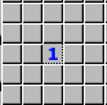
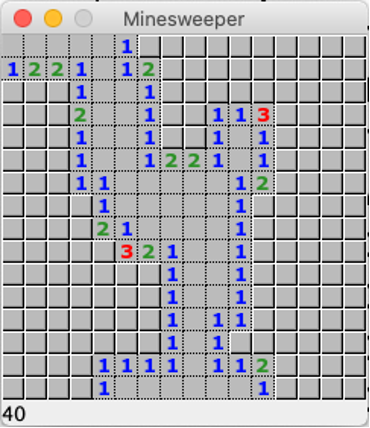
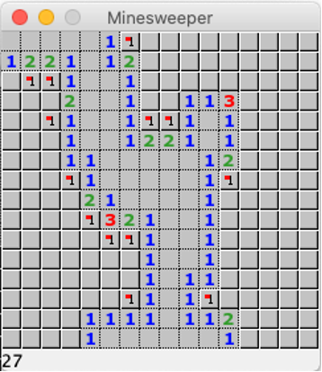
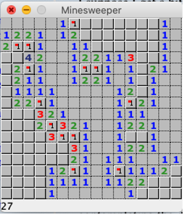
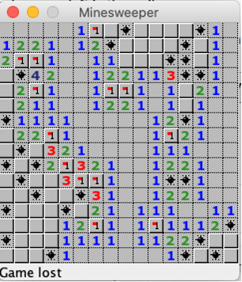

# MineSweeper

This is an interesting game based on Java Swing and Sqilte. There are a few things you should know before playing this game.

* **Always remember run the server at first!!!**
* *The game will have a 1000 second timer that will count down to zero, and the remaining time on the counter will be your score.*
* *You will be able to load and save previous games*.
* *When the counter hits zero, you lose, just as if you had hit a mine*.
* *You can open numerous new games at the same time*.
* *You can also click the `history` menu to view your best score!*
* *Ask your partners to play it with you, just enjoy!*

# Instructions for minesweeper beginners

As you can see, this creates a 16x16 grid of tiles, and there are 40 mines hidden throughout the grid.

If you click on a tile, hopefully there won’t be a mine there, but you will see a number indicating how many mines there are in adjacent tiles. For example, here, the number is “1”, which means in one of the 8 surrounding tiles, there is a mine:

Of course, we don’t know which one, and we can only guess and hope that when we click an adjacent tile, there will be only a 1 out of 8 chance of hitting a mine.

In the event that there are no adjacent mines (ie, that the number would be “0”), the game will automatically reveal tiles until it comes across tiles with an adjacent mine (and, thus, a number):

This makes things easier because now you can determine where some of the mines definitely are. You can right-click on the tiles where we can certainly be sure contains mines. 

This makes things easier because you have an indication for where the mines are (assuming you clicked correctly), and you can see that the number of mines has counted down from 40 to 27. Then you can click on tiles where you are sure there are no mines. For example, if a tile has a number of “1”, and you’ve set a flag on an adjacent tile, you can be sure that none of the other tiles have a mine, so you can click those:

Now you can see a few new opportunities where there are definitely mines. You can continue this until you finish all the tiles or hit a mine. In the event you left-click on a tile with a mine on it, the mines are revealed, and the game ends as a loss:

